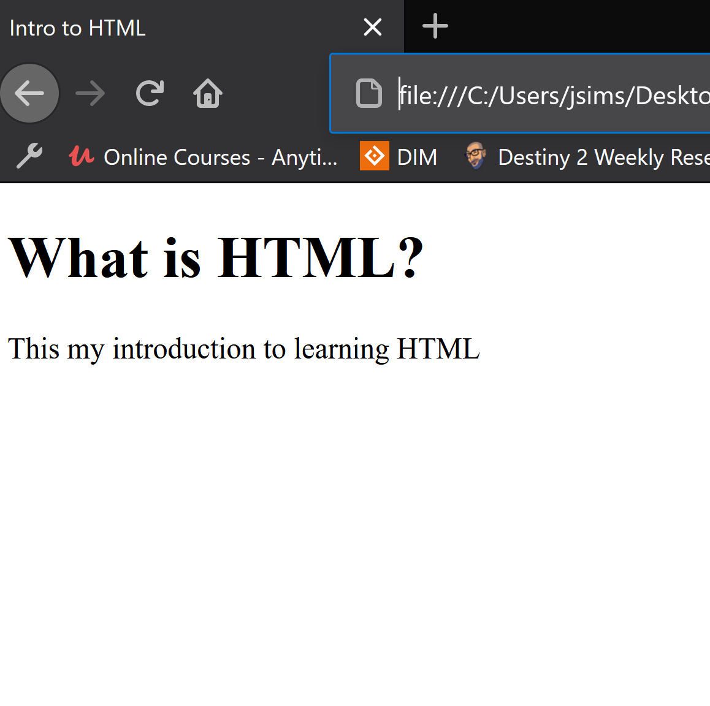

# What is HTML?
- HTML stands for Hypertext Markup Language and is the standard language used for creating web pages.
- It describes the structure of a web pages by using elements to define how content is shown.
- A web browser uses these elements to display the content.

Here is an example of a basic HTML document: 
```html
<!DOCTYPE html>
<html>
    <head>
        <title>Intro to HTML</title>
    </head>
    <body>
        <h1>What is HTML?</h1>
        <p>This my introduction to learning HTML</p>
    </body>
</html>

```
And here's what it looks like in the browser:



To about HTML elements, click "Next"

## [Home](README.md) |  [Next](html_elements.md)